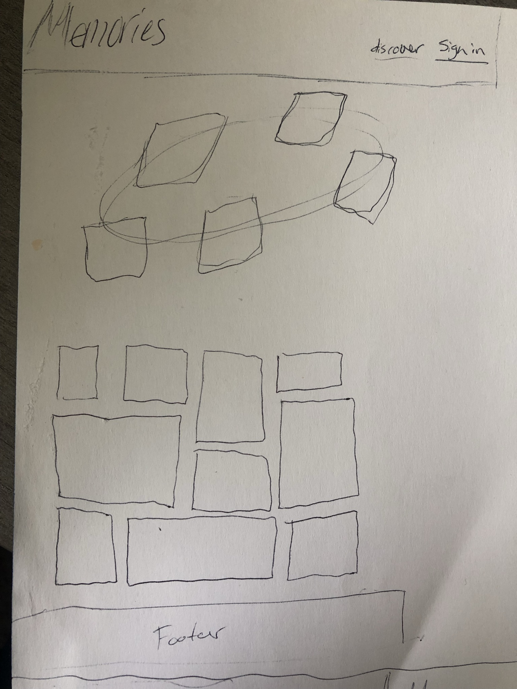
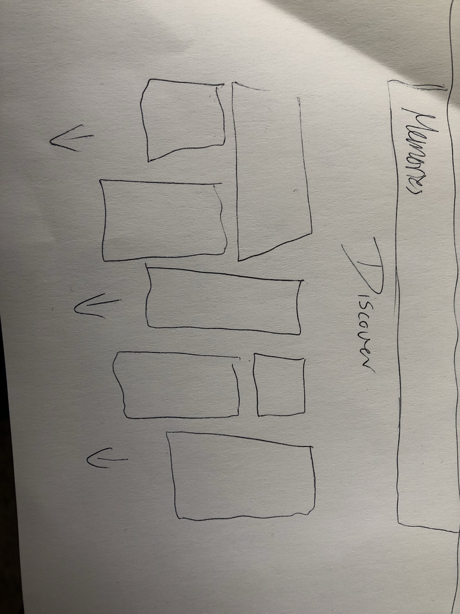
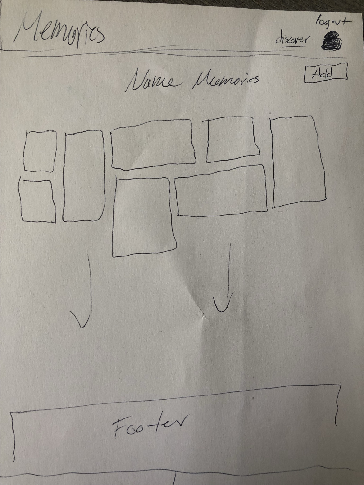

# Memories-FrontEnd

=================================================================

### User Stories:

Want a place to store photos that are dear to the heart in one place with the ability to give a brief description of that memory and any details that are important including year the photo was taken and who is in the photo.

- Ability to create a profile to upload images and input information about them.
- Ability to edit photo descriptions if needed.
- Ability to delete photos as needed.
  View a discover board that shows others posted photos.(Ability to comment)

### Features:

- Create Account/Edit/Delete
- Add Images plus descriptions/info on profile
- Edit descriptions and delete photo/descriptions
- View others posts on a discover board
- Implement Redux / Redux-toolkit and CSS framework (Material UI)

## Wireframing

